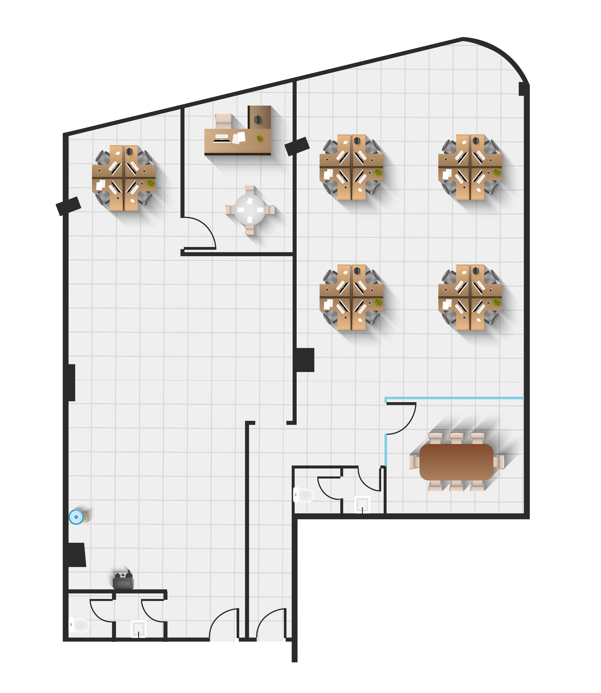

<!-- 
 -->

  

🌍In-out door pathes 🌍:

Hello ! 

 

## # Description: 📔
This is a practice to search in the map using a Geocoding API, making indoor paths, outdoor path, in-out door paths, adding georeferencing images, draw "polygons - polyline - icons" in the map and find user location using the available tools in his device.

 

## # Application features: 📋
- You can search to a point in the map"POI, street, city, country..." using Geocoding API.
- Allocate user location.
- User can find the path between him and any indoor POI either he is in or out of the building.
- The map has some interaction features like zoom in-out and rotate.
-User can pick between five different main map layers.
- User can see deferent features when changing the zoom levels.
- User can add or remove the grids from the map.

 

## # Used APIs: 📬
### 1- PenNav API: ("http://82.212.107.181:8090/PenNav_API/DataAPI.svc/"):
> For indoor edges, POI's and finding shortest path. 
#### Routs:
- Post('**/GetFloorsEdges**'): Used to get the floor edges for indoor pathes. 
- Post('**/GetPoIByFloor**'): Used to get the point of interests indoor. 
- Post('**/getPathToPoI**'): Used to get the path between edges and POI's indoor.

 

### 2- Location Iq API: ("https://eu1.locationiq.com/v1/search.php?key=d4328e89827d71&q=${query}&format=json"):
> Its a Geocoding API, used to find coordinate for elements on the map.

 

### 3- OSRM API: ("https://router.project-osrm.org/route/v1/driving/${position.coords.longitude},${position.coords.latitude};${results1.lon},${results1.lat};${results.lon},${results.lat}?alternatives=true&overview=full&annotations=nodes&geometries=geojson"):
> Its a routing API, used to find the path between **multiple** coordinate pairs on map "Out-door navigation".

## # Libraries and Framworks: ✨
### 1- Open layers: for maps rendering.
### 2- jQuery: to write js easly and fast.

 

## # Dependances: 👍
### 1- body-parser: allow the use of json body in post request.
### 2- cors: Cross-Origin Resource Sharing.
### 3- ejs: allow us to use templeting file type where we can mix js with html easly.
### 4- express: make a node server easly.

## # Research about pest price/accuracy Geocoding API: 🔎
>[Press me](public/data/bestGeocodingAPI.xlsx)

 

## # Maps layers: 🗺️
### With no keys:
- Open Street Map Standard.
- Open Street Map Humanitarian.
- Stamen Terrain.
- Satelite Layer.

### Need key:
- Bing Satelite Layer.

 

## # You can try the application using this link:
>[Enjoy 😉](https://geo-referencing.herokuapp.com/)

